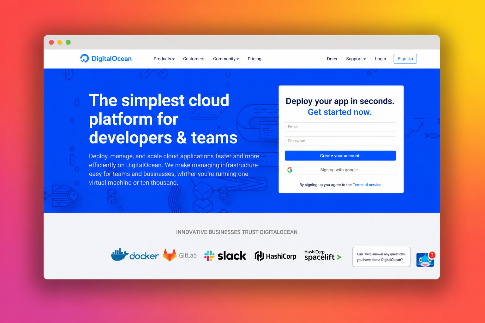

# DigitalOcean Homepage Clone

A pixel-faithful clone of the DigitalOcean homepage, built with HTML and CSS only. The goal was to reproduce a real, complex marketing page at desktop resolution.

**[Live demo](https://francescopierfederici.github.io/html-css-digitalocean/)**

## What this project is

A static, single-page reproduction of the DigitalOcean homepage as it appeared in 2021. Built only with HTML and CSS, no JavaScript, no frameworks. Layout is built with classic CSS techniques (positioning, display inline-block, utility classes), focused on faithful typography, spacing and hover states at desktop resolution.

## Tech stack

| Area | Tools |
|---|---|
| Markup | HTML5 |
| Styling | CSS3 (positioning, inline-block, utility classes) |
| Hosting | GitHub Pages |

## Project structure
├── index.html
├── style.css
└── img/
